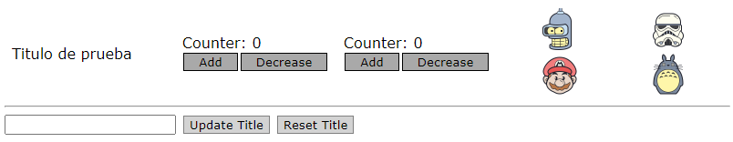

# Prueba Componentes Dinámicos

Prueba de inserción de componentes en otro de manera dinámica, en tiempo de ejecución.

El componente que hace de contenedor recibe como parámetro una lista con los componentes que ha de insertar.

## Captura de pantalla

## Demo

[https://theguitxo.github.io/pruebaComponentesDinamicos/](https://theguitxo.github.io/pruebaComponentesDinamicos/)

